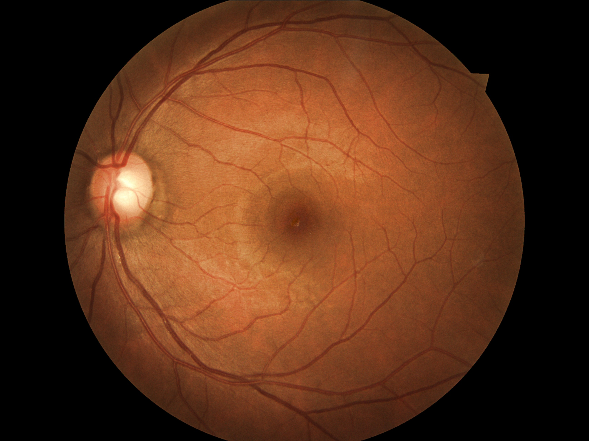

# Diabetic Retinopathy Classification

Diabetic Retinopathy is an eye condition caused by damage to the blood vessels in the retina due to high blood sugar levels. It's a common complication of diabetes that can lead to vision impairment or blindness if left untreated.

This project aims to create an automated system to classify diabetic retinopathy into one of five classes based on high-resolution retina images. The project is based on a Kaggle competition dataset, where a clinician has labeled each image with a severity score ranging from 0 to 4.

## Table of Contents

- [Overview](#overview)
- [Dataset](#dataset)
- [File Descriptions](#file-descriptions)
- [Model Architecture](#model-architecture)
- [Image Preprocessing](#image-preprocessing)
- [Training](#training)
- [Results](#results)
- [Installation](#installation)
- [License](#license)

## Overview

The project classifies retina images into the following five classes:

- **0** - No Diabetic Retinopathy
- **1** - Mild
- **2** - Moderate
- **3** - Severe
- **4** - Proliferative Diabetic Retinopathy

<br>



*Figure 1: An example of an eye image rated 0 (No Diabetic Retinopathy).*


## Dataset

The dataset used in this project is provided by a Kaggle competition. It includes:

- A large set of high-resolution retina images from different models and types of cameras.
- Each subject has both left and right eye images, labeled with a subject ID and left/right indicator (e.g., `1_left.jpeg` is the left eye of patient ID 1).
- Images are rated by a clinician on a scale from 0 to 4, representing the severity of diabetic retinopathy.

## File Descriptions

- **dr-model**:
  - **config.py**: Holds configuration settings and hyperparameters for the project.
  - **dataset.py**: Manages dataset loading and preprocessing.
  - **resize_img.py**: Script for resizing images to a uniform size.
  - **test.ipynb**: Jupyter notebook for testing and evaluating the model.
  - **train.py**: The main script used for training the model.
  - **utils.py**: Includes utility functions to support training and evaluation processes.
- **data**:
  - **test_set**: Subfolder with resized test images divided into several parts.
  - **train_set**: Subfolder with resized training images divided into multiple parts.
- **trainLabels.csv**: CSV file containing labels for the training dataset.
- **valLabels.csv**: CSV file containing labels for the validation dataset.
- **requirements.txt**: Lists all necessary dependencies and packages needed for the project.


## Model Architecture

I employed the EfficientNet architecture. Key features include:

- **EfficientNet**: Pre-trained and fine-tuned for diabetic retinopathy classification.
- **Left and Right Eye Blending**: Utilizing images from both the left and right eyes of each patient allows the model to leverage additional information. I pretrain EfficientNet on single-eye images and extract features from both eyes, then concatenate them. A separate fully connected network is then trained on these combined features, enhancing the model’s accuracy.
- **Image Augmentation**: Includes rotation, flipping, and scaling to handle variations and improve generalization.

## Image Preprocessing

The project uses the `albumentations` library to perform data augmentation and preprocessing, enhancing the model's ability to generalize and handle variations in the dataset. 

### Training Transformations

A series of augmentations such as resizing, cropping, flipping, and color adjustments are applied to the training images to introduce variability.

### Validation Transformations

For validation, simpler transformations are applied to maintain consistency and evaluate the model's performance accurately.

## Training

The model is trained using PyTorch with the EfficientNet architecture for diabetic retinopathy classification. Key aspects of the training process are as follows:

1. **Data Loading**: 
   - The training, validation, and test datasets are loaded using `DataLoader`.
   
2. **Model Architecture**: 
   - EfficientNet-B3 is used as the base model.
   
3. **Training Loop**: 
   - The model is trained using a combination of techniques such as mixed precision training (via `torch.cuda.amp`) and backpropagation to optimize the model weights.
   - Mean Squared Error (MSE) loss is used as the loss function, and the optimizer is Adam with weight decay for regularization.
   
4. **Checkpointing**:
   - The model state and optimizer are periodically saved during training, for recovery and further training.

5. **Validation**:
   - After each epoch, the model's performance is evaluated using the Quadratic Weighted Kappa score.

6. **Inference**:
   - The final trained model is used to make predictions on the test set.


## Results

The model achieved an accuracy of **74%** on the validation set. Future improvements to increase accuracy could include:

- **Higher Resolution**: Increasing the image resolution for better accuracy with the model by capturing more detailed features in the retina images.
- **Train Validation**: Train on the validation dataset to refine the model's performance and reduce overfitting by providing diverse examples during training.
- **Ensemble CNN Models**: Combining predictions from multiple convolutional neural networks to leverage each model's strengths and improve overall classification accuracy.
- **Tweak Loss Values**: Experimenting with different loss functions or adjusting loss weights to better handle class imbalances and optimize the model's learning process.


## Installation

1. **Clone the repository:**

   ```bash
   git clone https://github.com/rkhera04/DiabeticRetinopathy-CVProject.git
   ```
   
2. **Install dependencies:**

   ```bash
   pip install -r requirements.txt
 
## License

This project is licensed under the MIT License - see the [LICENSE](LICENSE) file for details.

